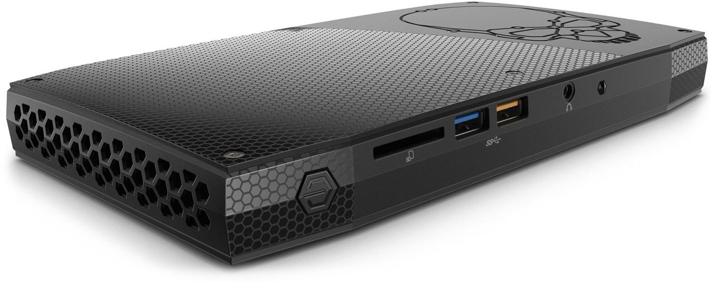

# Skull Canyon

Notes on setting up Ubuntu 18.04 LTS (Bionic Beaver) on Intel NUC6i7KYK [tech-spec [PDF]](https://github.com/rm-hull/skull-canyon/raw/master/docs/NUC6i7KYK_TechProdSpec.pdf)

## Components
* [Intel NUC6i7KYK](http://www.intel.co.uk/content/www/uk/en/nuc/nuc-kit-nuc6i7kyk-features-configurations.html) -
  6th generation Intel® Core™ i7-6770HQ processor with Intel® Iris™ Pro graphics (2.6 to 3.5 GHz Turbo, Quad Core,
  6 MB Cache, 45W TDP).
* [950 PRO NVMe M.2 SSD](http://www.samsung.com/uk/consumer/memory-storage/ssd/950-pro/MZ-V5P256BW) - 256Gb,
  NVMe SSD powered by Samsung V-NAND technology. Up to 2,200MB/s sequential read and 900MB/s write.
* [Komputerbay 32GB ( 2x 16GB) SODIMM](https://www.amazon.co.uk/gp/product/B01H44ARFM) -  Laptop Memory Upgrade
  DDR4 2400MHz PC4-19200 SODIMM 2Rx8 CL16 1.2v Notebook RAM.
* [Microsoft All-in-One Media Keyboard](https://www.microsoft.com/accessories/en-gb/products/keyboards/all-in-one-media-keyboard/n9z-00006).

## Download Ubuntu 18.04
Dowfnload 64-bit desktop ISO image (1.5Gb) from http://old-releases.ubuntu.com/releases/bionic/ and use
_Startup Disk Creator_ to burn to a USB drive.

## BIOS Settings
BIOS & firmware updates available from: https://downloadcenter.intel.com/product/89187/Intel-NUC-Kit-NUC6i7KYK

### Fast Boot
Enabling fast boot means that there is no straightforward way to get to the BIOS settings, as the splash screen
with F2 / F7 / etc options is skipped entirely. With the machine powered off, press and hold the power button
for 3-4 seconds then release. You should see a menu appear listing various options, one of which is BIOS Setup
(press F2).

### Blink Codes and Beep Codes
The power LED on the Intel® NUC blinks in a pattern if an error occurs during POST.
Intel NUC products that include a front panel audio jack produce an audible beep pattern
that you can hear through headphones or speakers plugged into that jack.

| Code | Diagnosis | Pattern |
|------|-----------|---------|
| 3 blinks (3 beeps) | Memory error | On-off (1.0 second each) three times, then 2.5-second pause (off). The pattern repeats until the computer is powered off. Some memory sticks, while supported by hardware spec, can still cause issues. Some errors can be fixed by removing one stick if two are installed. A non complete list of supported RAM can be found [here](http://www.intel.com/content/www/us/en/support/boards-and-kits/000020648.html). |
| Continual blinks | BIOS Update in progress | Off when the update starts, then on for 0.5 seconds, then off for 0.5 seconds. The pattern repeats until the BIOS update is complete. |
| 2 blinks (2 beeps) | Video error (when no VGA option ROM is found) | On-off (1.0 second each) two times, then 2.5-second pause (off). The pattern repeats until the computer is powered off. |
| 16 on/off blinks (8 beeps) | CPU thermal trip warning | 0.25 seconds on, 0.25 seconds off, 0.25 seconds on, 0.25 seconds off, for a total of 16 blinks. Then the computer shuts down. |

BIOS **KYSKLi70.86A.0046.2017.0407.1426** installed.

### References
* http://www.virtuallyghetto.com/2016/05/heads-up-esxi-not-working-on-the-new-intel-nuc-skull-canyon.html

## Keyboard Mappings
`showkey` displays the key mappings and `keytouch-editor` allows custom key mappings to be created.

### References
* http://unix.stackexchange.com/questions/198715/media-key-problems-with-microsoft-keyboard
* http://unix.stackexchange.com/questions/227264/is-it-possible-to-tweak-input-from-touchpad
* http://askubuntu.com/questions/363346/how-to-permanently-switch-caps-lock-and-esc

## Ubuntu Install
On _Installation type_ screen, don't pick 'Encrypt the new Ubuntu installation
for security': Use home folders encryption instead.

### /etc/fstab
Alter _/etc/fstab_ to set the root partition options to include **noatime**.
Remount with `sudo mount -o remount /` (does not need a reboot).

### Terminal Settings
* Terminal size: _80 x 43_
* Custom font: _Monospace Regular 10_
* Colors: _Grey on black_
* Use transparent background: _10%_
* Limit scrollback: _Unlimited_

### SSH Key generation
Generate an RSA public/private keypair with `ssh-keygen`. Upload the public key
to github, and add to https://github.com/rm-hull/dotfiles/blob/master/.ssh/authorized_keys

### Pull down _Essentials pour le vim exigeants basés programmeur informatique agiotage_
From a command prompt:

    $ sudo apt-get install git
    $ git clone git@github.com:rm-hull/dotfiles.git
    $ cd dotfiles
    $ ./bootstrap.sh

Answer 'y' when prompted.

Copy _~/.apt-lists/*_ into _/etc/apt/sources.list.d_ as root, and trust the keys:

    $ sudo cp -av ~/.apt-lists/*.list /etc/apt/sources.list.d
    $ sudo apt-key add ~/.apt-lists/TRUSTED-KEYS.txt

### APT Packages
Install some common packages from the Ubuntu mines:

    $ sudo apt install git htop tree nfs-client sshfs gimp openssh-server \
        exuberant-ctags silversearcher-ag postgresql postgresql-client \
        openvpn network-manager-openvpn network-manager-openvpn-gnome \
        optipng p7zip unrar mplayer ffmpeg gitg conky-all acpi vim-gtk \
        ttf-mscorefonts-installer httpie jq awscli python-pip python3-pip

Next install some packages from other sources:

    $ sudo apt install virtualbox-5.2 oracle-java8-installer \
        oracle0java10-installer google-chrome-stable nodejs sbt

### NFS Mount Point
Create a mount point with `sudo mkdir -p /mnt/atrax` and add the following
entry to _/etc/fstab_:

    192.168.1.65:/  /mnt/atrax    nfs4 _netdev,auto,intr,timeo=14,x-systemd.device-timeout=3s,nofail,noatime  0   0

Mount it, and re-assign links:

    $ sudo mount /mnt/atrax
    $ cd ~
    $ rm -rf Documents Music Videos Pictures
    $ ln -s /mnt/atrax/users/rhu/Documents
    $ ln -s /mnt/atrax/media/Music
    $ ln -s /mnt/atrax/media/Photos Pictures
    $ ln -s /mnt/atrax/media/Videos

### Benchmarking

#### CPU
* Skull Canyon: 41472.00 BogoMIPS
* i7-4700MQ: 38312.84 BogoMIPS

#### I/O
Running `hdparm -tT /dev/...`:

| Device                | Drive              | Buffered Reads | Cached Reads    |
|-----------------------|--------------------|---------------:|----------------:|
| Skull Canyon          | Samsung 970 PRO M2 | 2239.87 MB/sec | 12689.42 MB/sec |
| Skull Canyon          | Samsung 950 PRO M2 | 2055.28 MB/sec | 13037.37 MB/sec |
| i7-4700MQ             | Kingson v300 SATA  |  308.45 MB/sec |  8916.75 MB/sec |
| HP Proliant Server    | WD 7200RPM HDD     |   11.10 MB/sec |  1403.80 MB/sec |
| Digital Ocean droplet | Virtualized SSD    |  270.41 MB/sec |  6461.35 MB/sec |

## Troubleshooting

To stop repeated `[ 9351.591170] iwlwifi 0000:03:00.0: Queue 11 stuck for 2000
ms.` messages and catatonic WiFi performance, edit edit
_/etc/modprobe.d/iwlwifi.conf_ and add:

    options iwlwifi 11n_disable=1

This disables Wireless-N networking. The fault appear to be firmware related
and limited to certain networks.

### References
* http://unix.stackexchange.com/questions/139201/how-can-i-prevent-my-wifi-driver-from-going-catatonic
* http://unix.stackexchange.com/questions/90687/recurrent-loss-of-wireless-connectivity/90689#90689
* https://wiki.archlinux.org/index.php/Java_Runtime_Environment_fonts
